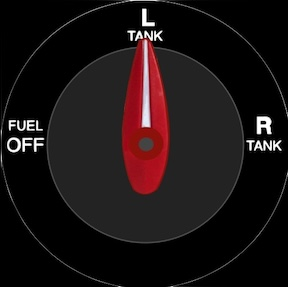

## Air Manager

I purchased a copy of Air Manager two years ago for my first desktop sim and it’s the only component still used from that era, it's been reliable and a fun tool.  My current panel also has a knobster, unused now but available later.

The $25 Air Manager G5 was the best I found, more realistic than Asobo and without the pop-out hassles.  I use a JPI from the community 

## Oil Guage

## Tach

## Manifold

## Fuel Lever

## Garmin
[Air Manager for Garmin](https://github.com/radiobillm/DakotaSim/archive/refs/tags/v1.0-airmanager-garmin.zip)

## GNC-255 Radio

  
## GTX-345 Transponder

