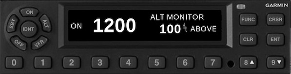
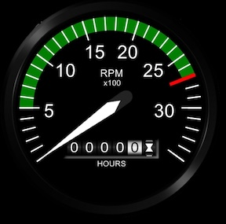

# Air Manager

I purchased a copy of Air Manager two years ago for my first desktop sim and it’s the only component still used from that era, it's been reliable and a fun tool.  My current panel also has a knobster, unused now but available later.

## G5
The $25 Air Manager G5 was the best I found, more realistic than Asobo and without the pop-out hassles.  SIM Innovations makes Air Manager and has good instructions for using the RealSimGear bezel controls.  I also use the JPI EDM.

## Custom Instruments
I created my own instruments below.  I still use my Manifold and Tach gauges.  The 255 radio has been replaced with a much better hardware version and I'm not now using the others.  

### Garmin Radios
[Air Manager for Garmin](https://github.com/radiobillm/DakotaSim/archive/refs/tags/v1.0-airmanager-garmin.zip) zip file

#### GNC-255 Com-Nav Radio

  
#### GTX-345 Transponder

### Dakota Gauges and Lever
[Air Manager for Dakota](https://github.com/radiobillm/DakotaSim/archive/refs/tags/v1.0-airmanager-garmin.zip) zip file

#### Fuel Gauge

#### Oil Gauge

#### Tach

#### Manifold

#### Fuel Lever

