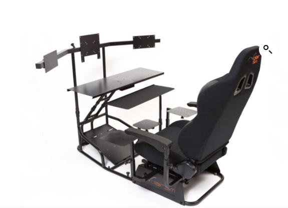
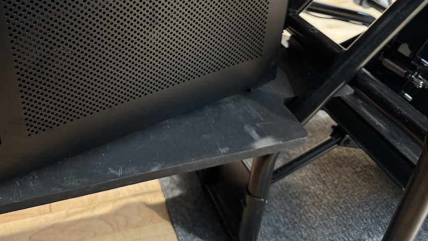

# Chassis Mods

Volair’s Sim Chassis is sturdy and adjustable, the seat is comfortable.   The optional keyboard tray and armrests are nice.  I’ve not used any of the multiple plate mount attachments included.  

Their monitor support would be good for even a heavy single center monitor, but not for three.  I’ve replaced the monitor poles with rear table supports and built a floating shelf for the iTX computer case.

Not discussed elsewhere I originally purchased with the Volair G1000 panel.  The panel has a heavy-duty metal structure, back and table.  Before this version I cut away most of the panel inset to replace with my custom instrument panel.  The project has the original sketchup model with their panel carefully measured.
