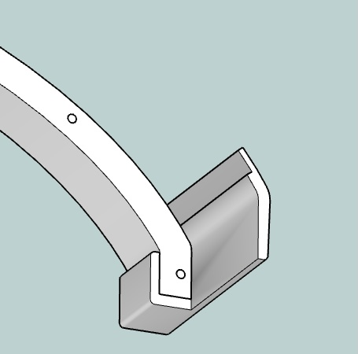
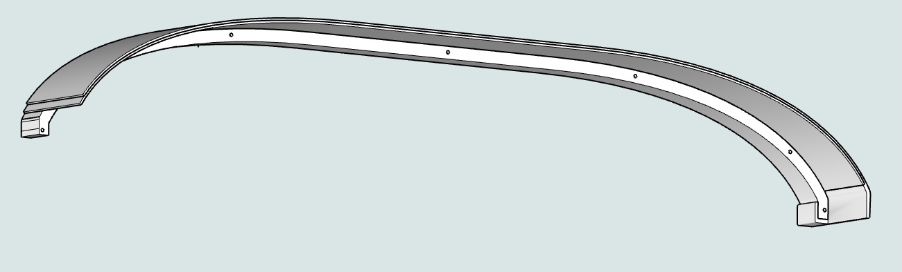
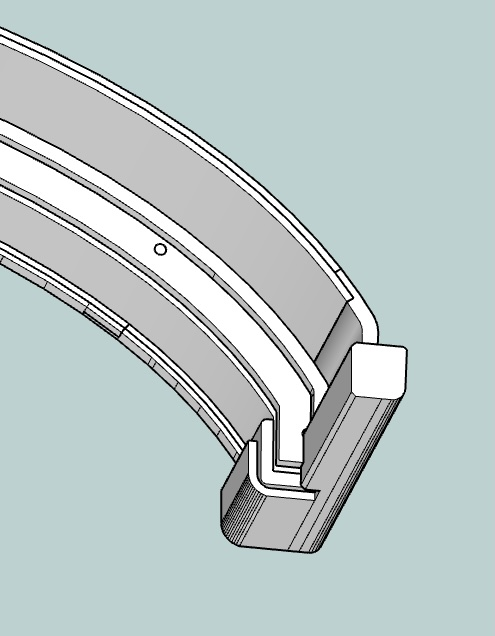

* TOC
{:toc}

# Cockpit Structure
## Avionics Panel and Table

### Panel
#### Laser Cutting Plywood

The firm upgrading our avionics supplied a pdf which became the scaled panel layout (\panel\01l-panel-pdf).  I made a few compromises because my panel rides on the front of a support table and for the 14” right side monitor.

The panel is from two 3.2mm Sandee layers laser cut and glued together.  The back layer has larger openings that outline the switch and monitors.  Front layer cutouts for the monitors and switch panel are smaller for a recessed mount.  Before this two-layer build I had used the CNC to cut and recess openings.  But after finding build conflicts I moved to two layers, because I had the material and could quickly cut with the laser.

Each item on the panel has a group and layers to model in 3D.  Templates from RealSimGear I found did not work well on earlier sims, mine are from trial and error with cardboard test pieces.

My 44W laser cuts the 2.6mm plywood at 15 mm/second and 100% power.

To produce an file for cutting the panel requires showing the *-cut layer within each group. These layers should be tagged as “-cut”.  The switch and monitors are recessed with cut lines for each layer.

#### Embedded Displays
To fully embed LCD displays and have flush instruments my prior panel was from a ¼” plywood back, ½” thick cardboard center and ¼” ACM front.  It looked great, but was complicated and unrealistic because our real instruments are surface mounted.

Initially, I experimented with different mounting designs—including tabs—but found that toggle brackets provided the most secure fit. These same brackets were also used to mount the right-side monitor and switch assembly.

#### Auto Wrap

The panel front is covered with **black matt auto wrap** which worked surprisingly well. My main lesson was to apply over a sanded clear poly.  Even after wiping twice, bare plywood held small flakes and every spec showed through the wrap. I used a heat gun to stretch slightly and cut openings after applying.  If building a second model I’d try to wrap the plywood before the laser cut.

The prior black ACM panel looked great.  But after ruining a $40 ACM panel on the CNC, I decided to not wait and buy another. The plywood + wrap can be cut with just a laser.

A low-mounted monitor under the table displays the Air Manager Manifold and Tach gauges. The monitor is secured with 3D-printed brackets, glued using construction adhesive. 

The model has an unused gauge cutout layer. I may build stepper motor versions for our oil, fuel, manifold and tach that match our real plane.

### Table

The support Table is ½” plywood with edge and side pieces to replace the chassis metal. 

The side pieces are laser cut from 5.2mm plywood at 7mm/sec.  Laser lines etched into the table base made it clear where to cut and align the rail, sides and blocks.

The panel and table are setup for a left side yoke to be centered on the chair. The left side metal yoke box and the right side metal power strip help keep the assembly rigid. 

For support I replaced the original chassis monitor stand.  A 3/4”x24” threaded water pipe was cut in half and flanges attached to each end.  Those fit perfectly into the chassis to support the table.  The table and supports are painted flat black.  M6 bolts attach the table to the flange and front metal square tube, these holes are drilled after aligning and squaring the table but not in the.  A right-side leg supports the overhand and keeps the table stable.

For aesthetics and easier troubleshooting I took time for the component layout above and under the table and designed and printed holders for power supplies, USB hubs, and HDMI adapters.

## Glare Shield & Enclosure

The glare shield has been the most time-consuming part of the build. My trepidation building one had me hacking the Volair panel for too long. But my first glare shield is only OK.

The curved vertical back of the glare shield (glare-base layer) is built from two laminated ½” plywood pieces, cut on the CNC. 

For the horizontal face, I initially scored and steamed ⅛” plywood, attempting to bend it around the PA-28’s tight end curves.  This was slow and the material kept splitting. The process was slow, and the material kept splitting.  So I abandoned the approach instead printing end pieces for the steep curve (end-right/left). These are notched for the wood layers and glued with construction adhesive, it worked well.  

The plywood and 3D-printed end assembly created a strong base for laminating two layers of 2.6mm plywood, which I formed and clamped to the curved back and end sections.

A second ¼” plywood curve was added to reinforce the structure and create a pocket for the panel. A thin ¼” plywood trim was also added to house the LED rope and provide a termination point for the foam covering. The LED rope doubles as a piping cord, securing the vinyl cover material in place.

The entire assembly was painted flat black before applying the foam padding and vinyl cover.

Long M4 screws were installed through the back to secure the vinyl trim and attach the glare shelf to the panel. Although I forgot to include screw inserts, the friction fit is strong enough to hold it in place.

When wrapping the ¼” neoprene foam, I made the mistake of applying strong adhesive to the front edge first. I realized the foam wouldn't stretch or compress well around sharp curves. Attempting to soften it with a heat gun only caused it to break down. I had to cut V-gaps to fit the shape, but those gaps are still visible through the thin vinyl cover.

The assembly is then covered with a flexible leather-like adhesive-backed furniture patch material.  This also looks home-made because the curves and corners don’t tuck.  Next time I would either persuade my wife, learn or buy a sewn leather wrap formed for the surface.

Because the vinyl ends peel off, I then designed and printed relatively complex end caps.  

The back vinyl is covered with a trim cap.  The trim cap is from about 6 pieces printed and glued.  Another material laser or CNC cut would be cleaner and faster.

Finally, the panel is lit with LED rope which does double duty by tucking in the vinyl.  The LED strip glows nicely and can be cut at about 2” intervals.  Leads are soldered and run behind the panel and are terminated with a 2-pin connector for the dimmer box.

## Chassis & Frame

Volair’s Sim Chassis is sturdy and adjustable, the seat is comfortable.   The optional keyboard tray and armrests are nice.  I’ve not used any of the multiple plate mount attachments included.  

Their monitor support would be good for even a heavy single center monitor, but not for three.  I’ve replaced the monitor poles with rear table supports and built a floating shelf for the iTX computer case.

Not discussed elsewhere I originally purchased with the Volair G1000 panel.  The panel has a heavy-duty metal structure, back and table.  Before this version I cut away most of the panel inset to replace with my custom instrument panel.  The project has the original sketchup model with their panel carefully measured.
