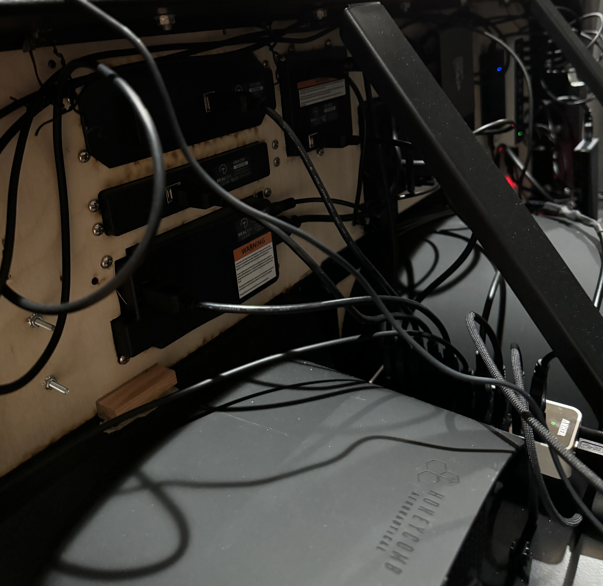

# Dakota Sim with Honeycomb

In late summer of 2023 we bought a share of a PA-28-235 so I had a specific plane to target.  This second generation sim was a big upgrade to build a dedicated sim and recover my office desk.  It includes avionics to match our glass upgrade in the real-life plane. 

The heart of our new panel is a Garmin G3X and no X-Plane version is available so I moved to Microsoft and Windows. 

Details that are distinct from this older version may help those using standard Honeycomb throttle/yoke panels.

## Panel
$500 [Volair panel](https://volairsim.com/product/volair-sim-avionics-panel-g1000/), metal cut out for my panel, excellent 

I cut out the top half and replaced with plywood, cardboard, and ACM buildup showin in the sketchup model.

## Fabrication
$200 for [MakeATX](https://www.makeatx.com/custom-cutting) local laser cutting, 3 cardboard test iterations, final ¼” plywood back

$150 ACM front panel from [SendCutSend](https://sendcutsend.com/materials/acm/), great service 

## Panel and chassis
$600 Triple monitor stand from [Simfab](https://simfab.com/product/triple-monitor-mount-stand/), excellent quality

$1000 [Volair chassis](https://volairsim.com/product/volair-sim-flight-racing-sim-cockpit/) with arm rests and keyboard mount, excellent build

## Computer
In addition to the i9 running MSFS, I added this machine to Air Manager monitors

$230 MeLE [Mini PC](https://www.amazon.com/gp/product/B0CP3YL6J7/) for dedicated Air Manager

### Instruments
$1200 [G500](https://realsimgear.com/products/realsimgear-g500-avionics-panel	) from RealSimGear (originally for X-Plane with no G3X)

$550 [GTN650](https://realsimgear.com/products/realsimgear-gtn650-bezel-for-x-plane-p3d-and-fsx-steam) from RealSimGear

$350 [GFC500](https://realsimgear.com/products/realsimgear-gfc500-autopilot-for-x-plane-p3d-fsx) from RealSimGear

$350 [G5](https://realsimgear.com/products/realsimgear-g5-pfd-hsi-for-x-plane) from RealSimGear

$300 [GMA350](https://realsimgear.com/products/realsimgear-gma350-audio-panel-for-x-plane-p3d-fsx) from RealSimGear

$80 [Propwash Radio](https://www.propwashsim.com/)

## Panel LCD Displays
$70 [1920x1200](https://www.amazon.com/gp/product/B0DKFHZ8C8/) 14” left-side display for Air Manager compass, JPI engine, oil

$70 [1024x600](https://www.amazon.com/gp/product/B07VNX4ZWY/?th=1) 7” right-side touch display for Air Manager radio and transponder

$300 [1920x360](https://www.amazon.com/gp/product/B0CFY564ZQ) 24” low display for Air Manager fuel, manifold and tach

## Monitors and sound
$700 [Samsung Odyssey G9](https://www.amazon.com/gp/product/B0CP6HW894/) 49” Ultrawide monitor

$250 Two [Samsung 27” T35F](https://www.amazon.com/gp/product/B08FF3JQ28/) side monitors

$300 [Sonos Beam](https://www.sonos.com/en-us/shop/beam-b-stock-shadow), used Gen 1 (for an all Sonos-dude)

$85 [USB2GA Aviation Headset to USB Adapter](https://www.amazon.com/gp/product/B0CW3GLDM1/)

## Hubs, Power and Cables
$180 for two [StarTech USB to 4x HDMI](https://www.amazon.com/gp/product/B09BJWGPXR/)

$80 for two [Anker 10 Port 60W USB Hubs](https://www.amazon.com/gp/product/B00VDVCQ84/)

$21 [USB A to TOSLINK](https://www.amazon.com/gp/product/B0B2DBGKL3/r) for Sonos Beam audio

$20 [10A 12V Power supply](https://www.amazon.com/gp/product/B07MXXXBV8/) with custom hydra for RSG panel monitors

$57 [8 Outlet Metal Power Strip](https://www.amazon.com/gp/product/B0CJ55M1TH/)

$8 [12” USB-A Micro cable](https://www.amazon.com/gp/product/B095JZSHXQ/r)

$8 [12” USB-A to C cables](https://www.amazon.com/gp/product/B0BDFHBXQC/r)

$7 [18” HDMI cable](https://www.amazon.com/gp/product/B07ZC5Y3K2/r)

$9 [12” HDMI cables](https://www.amazon.com/gp/product/B0B5KN6853/)

$14 [6’ HDMI thin cables](https://www.amazon.com/gp/product/B00T58JLPI/r)
$10 [Displayport to HDMI adapters](https://www.amazon.com/gp/product/B09MTKHFKR/)
