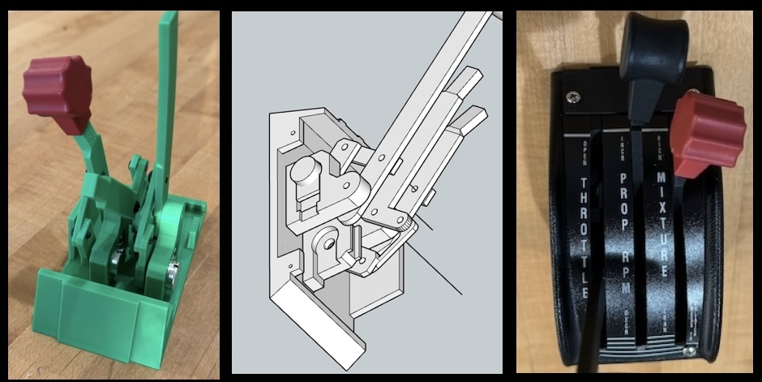

# Fabricated Controls
## PA28 Throttle

I started by buying a real replacement throttle assembly trim and label, then designed and 3D printed the body.  

To fit the closely spaced throttle, prop, and mixture levers, I used bellcranks to offset the potentiometers.

The M4 screws into 3mm PLA holes were not strong enough on their own and required glue for reinforcement. Threaded inserts would be a better solution, as the tight space makes soldering and adjustments difficult.

Label strips are glued to the top of the trim cover under a printed trim plate.

## Switch Panel

The hard part for the switch panel was sourcing rocker switches that match a real PA28.  I ordered a few alternatives but never found half-width rockers that could be ganged together to match the real set, nor found suitable grey covers.  

As a future improvement, I plan to laser engrave labels onto the switch covers for a more authentic look.

An Arduino Micro in the switch panel handles the switches, throttle, Carb Heat lever, and TOGO button. 

## Carb Heat

The Carb Heat lever is printed to sandwich the end of a metal toggle, the assembly also has a switch holder under the table.  A printed panel trim insert keeps the lever sliding vertically with a realistic feel.  MSFS offers Anti Ice On or Off, but no variable carb heat setting like a real PA28.

### Key Switch

I ordered the SimWales Key Switch from caspajack on eBay. The spring mechanism is well-designed, and the build quality is excellent.

One challenge was the table height meant moving the switch a little lower than in real life, even after cutting off the top of the assembly. The switch was disabled and the faceplate removed.  When reassembling I first aligned the key position and then the pin so it hits the spring on start. 

## Bezels

Simple bezels are printed for the yoke, manifold, and tach gauge, carb heat and togo switch openings.  I may build a bezel for the JPI Engine monitor.

