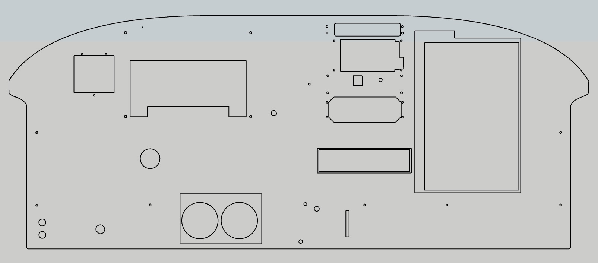

## Avionics Panel

## Laser Cutting Plywood

The firm upgrading our avionics supplied a pdf which became the scaled panel layout (\panel\01l-panel-pdf).  I made a few compromises because my panel rides on the front of a support table and for the 14” right side monitor.

The panel is from two 3.2mm Sandee layers laser cut and glued together.  The back layer has larger openings that outline the switch and monitors.  Front layer cutouts for the monitors and switch panel are smaller for a recessed mount.  Before this two-layer build I had used the CNC to cut and recess openings.  But after finding build conflicts I moved to two layers, because I had the material and could quickly cut with the laser.

Each item on the panel has a group and layers to model in 3D.  Templates from RealSimGear I found did not work well on earlier sims, mine are from trial and error with cardboard test pieces.

My 44W laser cuts the 2.6mm plywood at 15 mm/second and 100% power.

To produce an file for cutting the panel requires showing the *-cut layer within each group. These layers should be tagged as “-cut”.  The switch and monitors are recessed with cut lines for each layer.

## Embedded Displays
To fully embed LCD displays and have flush instruments my prior panel was from a ¼” plywood back, ½” thick cardboard center and ¼” ACM front.  It looked great, but was complicated and unrealistic because our real instruments are surface mounted.

Initially, I experimented with different mounting designs—including tabs—but found that toggle brackets provided the most secure fit. These same brackets were also used to mount the right-side monitor and switch assembly.

### Auto Wrap

The panel front is covered with **black matt auto wrap** which worked surprisingly well. My main lesson was to apply over a sanded clear poly.  Even after wiping twice, bare plywood held small flakes and every spec showed through the wrap. I used a heat gun to stretch slightly and cut openings after applying.  If building a second model I’d try to wrap the plywood before the laser cut.

The prior black ACM panel looked great.  But after ruining a $40 ACM panel on the CNC, I decided to not wait and buy another. The plywood + wrap can be cut with just a laser.

A low-mounted monitor under the table displays the Air Manager Manifold and Tach gauges. The monitor is secured with 3D-printed brackets, glued using construction adhesive. 

The model has an unused gauge cutout layer. I may build stepper motor versions for our oil, fuel, manifold and tach that match our real plane.
