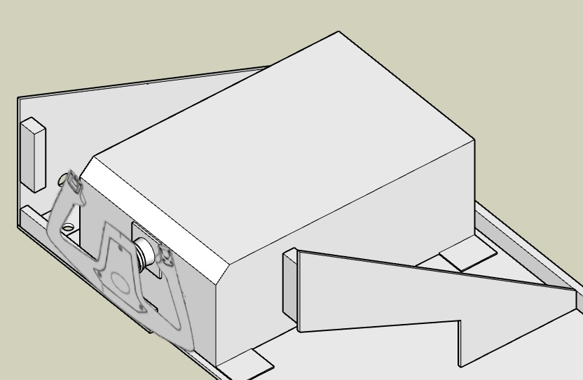
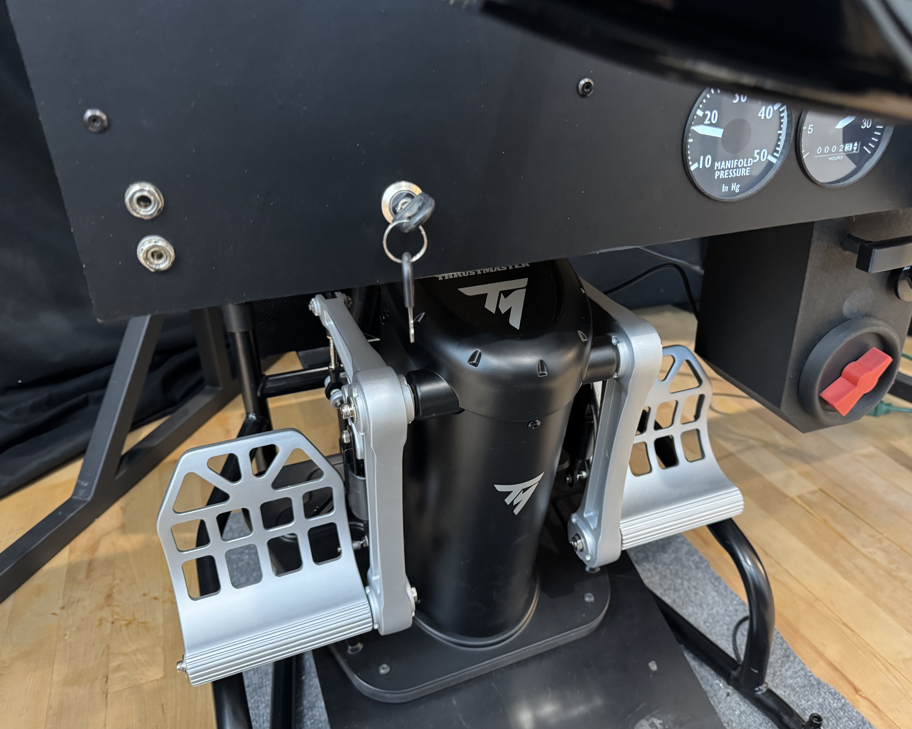

# Flitesim Force Yoke

The Flightsim Force Yoke works well and brings a fun realistic dimension flying the sim.  The yoke box is much bigger than a Honeycomb which became the final straw forcing me to build a fully custom table, panel, and glare shield.

# Thrustmaster TPR Pedals

Thrustmaster TPR pedals have worked well so far as a nice upgrade from the Logitech set.  The Volair chassis has a framed well area and the pedals are designed for a flat floor.  I solved it by cutting a ¾” spacer that matched the Thrustmaster base.  The spacer has threaded inserts that align with the top Volair slots and an extra hole drilled below, then inserts for the four Thrusmaster base bolts.  This approach has worked well so far even while the right pedal almost hits my center box.
