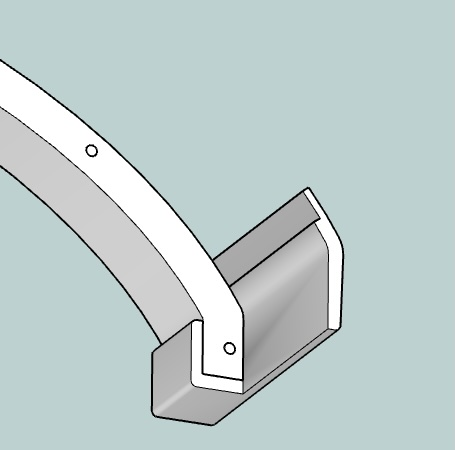
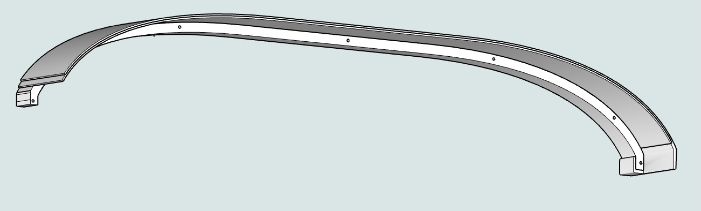
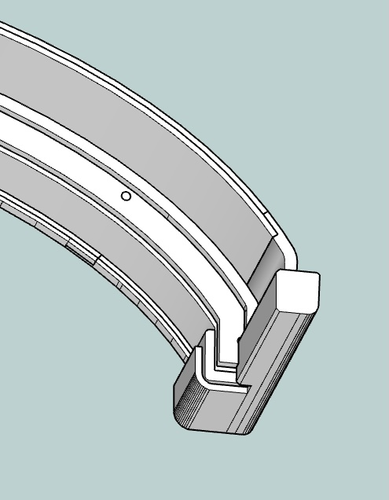

# Glare Shield 

The glare shield has been the most time-consuming part of the build. My trepidation building one had me hacking the Volair panel for too long. But my first glare shield is only OK.

## Back Structure

The curved vertical back of the glare shield (glare-base layer) is built from two laminated ½” plywood pieces, cut on the CNC. 

## Horizontal Shelf

For the horizontal face, I initially scored and steamed ⅛” plywood, attempting to bend it around the PA-28’s tight end curves.  This was slow and the material kept splitting. The process was slow, and the material kept splitting.  So I abandoned the approach instead printing end pieces for the steep curve (end-right/left). These are notched for the wood layers and glued with construction adhesive, it worked well.  

The plywood and 3D-printed end assembly created a strong base for laminating two layers of 2.6mm plywood, which I formed and clamped to the curved back and end sections.

A second ¼” plywood curve was added to reinforce the structure and create a pocket for the panel. A thin ¼” plywood trim was also added to house the LED rope and provide a termination point for the foam covering. The LED rope doubles as a piping cord, securing the vinyl cover material in place.

The entire assembly was painted flat black before applying the foam padding and vinyl cover.

Long M4 screws were installed through the back to secure the vinyl trim and attach the glare shelf to the panel. Although I forgot to include screw inserts, the friction fit is strong enough to hold it in place.

When wrapping the ¼” neoprene foam, I made the mistake of applying strong adhesive to the front edge first. I realized the foam wouldn't stretch or compress well around sharp curves. Attempting to soften it with a heat gun only caused it to break down. I had to cut V-gaps to fit the shape, but those gaps are still visible through the thin vinyl cover.

The assembly is then covered with a flexible leather-like adhesive-backed furniture patch material.  This also looks home-made because the curves and corners don’t tuck.  Next time I would either persuade my wife, learn or buy a sewn leather wrap formed for the surface.

## Printed Ends and Trim

Because the vinyl ends peel off, I then designed and printed relatively complex end caps.  

The back vinyl is covered with a trim cap.  The trim cap is from about 6 pieces printed and glued.  Another material laser or CNC cut would be cleaner and faster.

Finally, the panel is lit with LED rope which does double duty by tucking in the vinyl.  The LED strip glows nicely and can be cut at about 2” intervals.  Leads are soldered and run behind the panel and are terminated with a 2-pin connector for the dimmer box.
