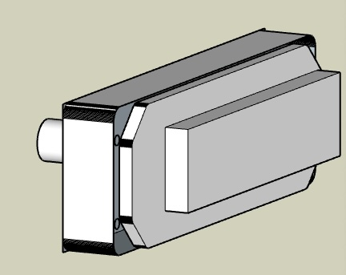

# Insrtruments

## GNC255 Radio

One of my favorite devices in this build is the GNC255 radio, designed and built by Tigerfly.. I have an early build and don’t know if it will be a product.  You can usually find Tigerfly helping others on the MobiFlight Discord.

The radio has realistic knobs and buttons, a bright white OLED display and photo sensor for dimming.  Like the real Garmin, Tigerfly’s software includes frequency database lookup.  

Tigerfly was especially helpful getting me started with MobiFlight and I hope he’ll extend the line with a matching transponder and/or share the design.

## RealSimGear

The setup includes these instruments

* G5 works well with the air manager instrument with buttons mapped
* G500 is from an earlier sim and for my G3X, I don’t love it
* GTN650 works well except the home button is fake
* GFC500 AutoPilot is very good, except their vertical trim knob is flimsy
* GMA350 Audio works, I don’t see on their website anymore 

Sketchup models are organized to use for 3d planning or just keeping the faceplate-cut to export for laser or cnc.

## Compass

The whiskey-style Compass was purchased from SimWales (via caspajack on eBay), and it looks fantastic.

Mobiflight controls the compass, I had to adjust the suggested settings to use a Display Scale of 9000 and Transform $ * (-12.5).  The compass is powered with a USB 5V USB cable. 
