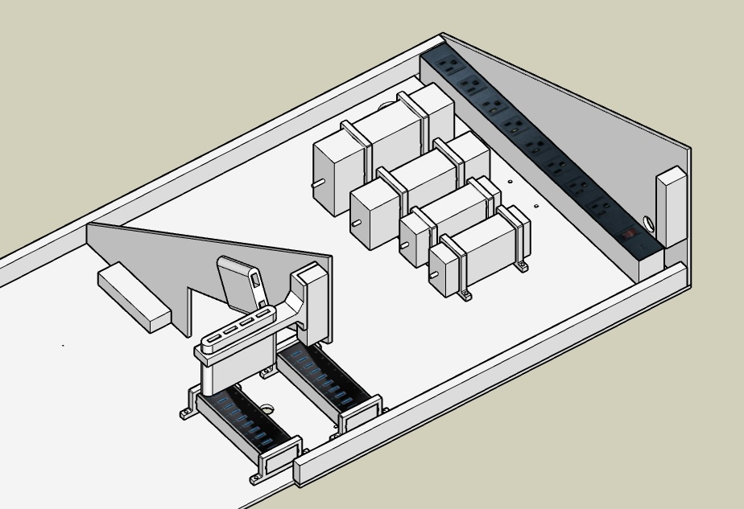

# Avionics Table

## Support Table

The support Table is ½” plywood with edge and side pieces to replace the chassis metal. 

The side pieces are laser cut from 5.2mm plywood at 7mm/sec.  Laser lines etched into the table base made it clear where to cut and align the rail, sides and blocks.

The panel and table are setup for a left side yoke to be centered on the chair. The left side metal yoke box and the right side metal power strip help keep the assembly rigid. 

For support I replaced the original chassis monitor stand.  A 3/4”x24” threaded water pipe was cut in half and flanges attached to each end.  Those fit perfectly into the chassis to support the table.  The table and supports are painted flat black.  M6 bolts attach the table to the flange and front metal square tube, these holes are drilled after aligning and squaring the table but not in the.  A right-side leg supports the overhand and keeps the table stable.

## Power and Hubs

For aesthetics and easier troubleshooting I took time for the component layout above and under the table and designed and printed holders for power supplies, USB hubs, and HDMI adapters.

## LED Dimmer

A printed box with lid mounted on the back of the panel houses an Arduino Pro Micro and compass stepper motor driver plus a dimmer connected to the compass and under-glare shelf lighting.  A hydra end from the 12V power supply powers the dimmer.
