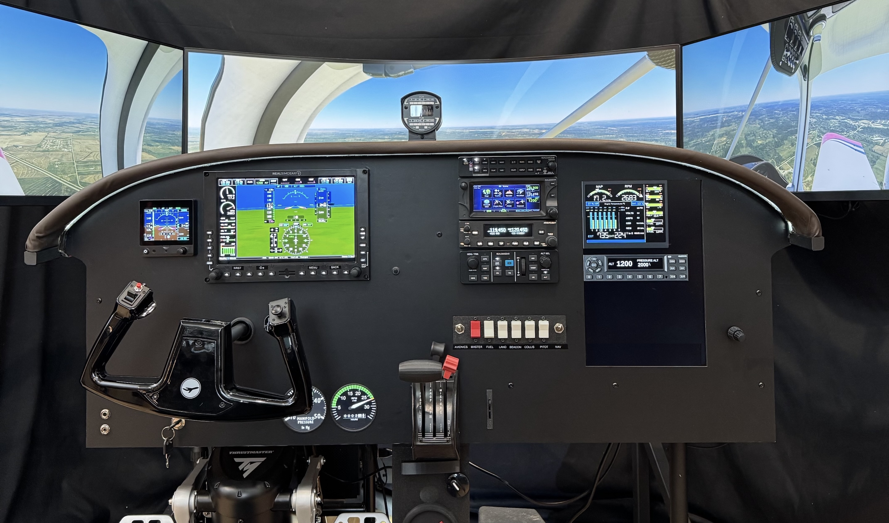
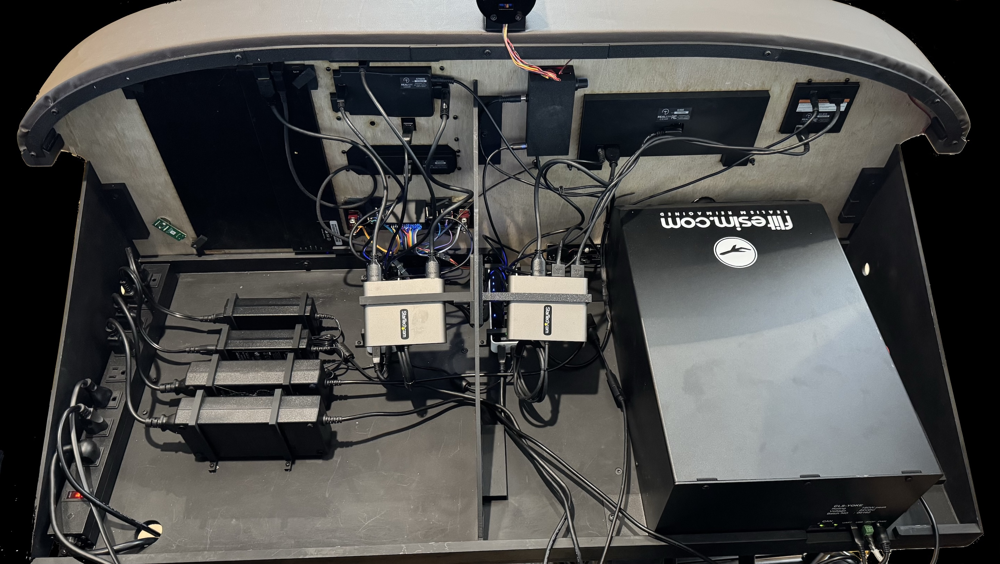

# Dakota Flight Simulator

February 2025

Welcome to the documentation for my flight simulator project. This Wiki contains details about the construction, components, and software used in the simulator.

The sim was built to practice IFR flying using new avionics that match our real plane. It has also been a great opportunity to learn Arduino and explore my Onefinity CNC/Laser.

ChatGPT tells me that Piper has sold about 30,000 PA-28 series aircraft, compared to 45,000 Cessna 172/182 models. It’s surprising—and somewhat frustrating—for Piper pilots that most commercial flight sim products are Cessna-based. This project was built to create a sim that closely matches our plane.

The sim community is a gem.  After learning from so many projects and discussions, I felt guilty for never sharing my work.  This document includes the key components, build details, and lessons learned that I believe will be most helpful to others.

The current build would cost about $10,000. The project includes a breakdown of parts and prices.

## Cockpit Structure
- [Avionics Panel](Panel.md); laser cutting, auto wrap
- [Avionics Table](Table.md); support, power, dimmer, hubs
- [Volair Chassis](Chassis.md); computer shelf
  
## Fabricated Controls
- [Throttle, Switch, & Panel Controls](Panel-Controls.md)
- [Center Stack , Brake, Fuel](Center-Controls.md)
- [Trim and Flaps](Trim-flaps.md)

## Arduinio
- [Arduino Hardware](Arduino.md)
- [Ardunio Software / FS2020](Arduino-sw.md)
  
## Other Purchased Hardware
- [RSG and Tigerfly Instruments](Instruments.md)
- [Flitesim Yoke, Thrustmaster Pedals](Yoke-pedals.md)
- [Monitors and Sound](Monitors-Sound.md)
- [Computer](Computer.md)

## Software
- [Software & Config Notes](Software.md)
- [Air Manger Instruments](AirManager.md)
- [SketchUp & Fabrication Files](SketchUp-Fabrication-Files)

## Parts List
- [Parts List & Pricing](Parts-Price.md)
