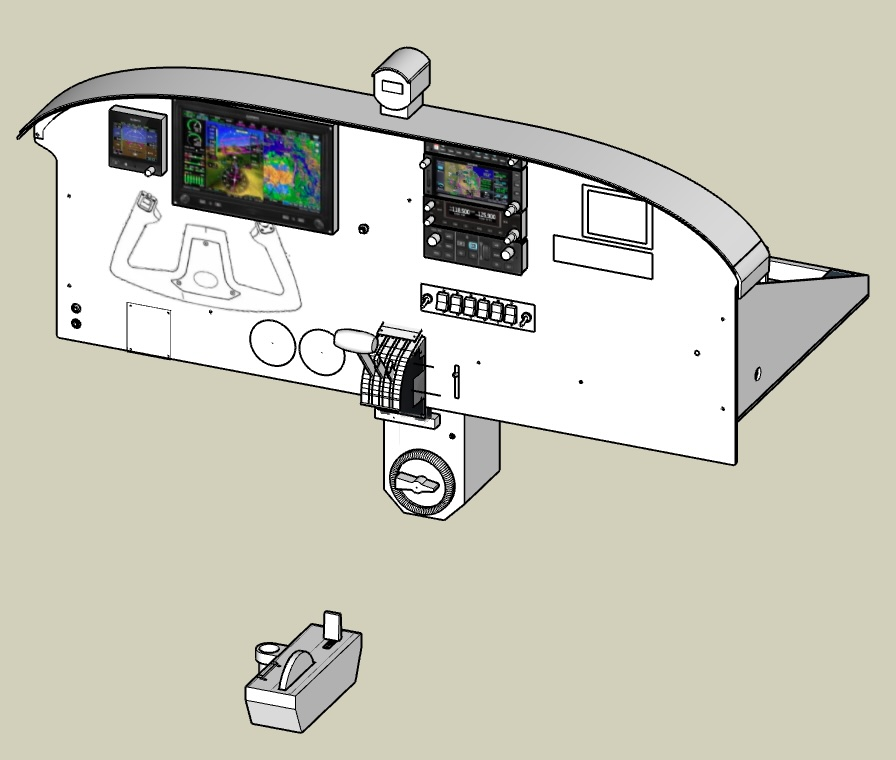
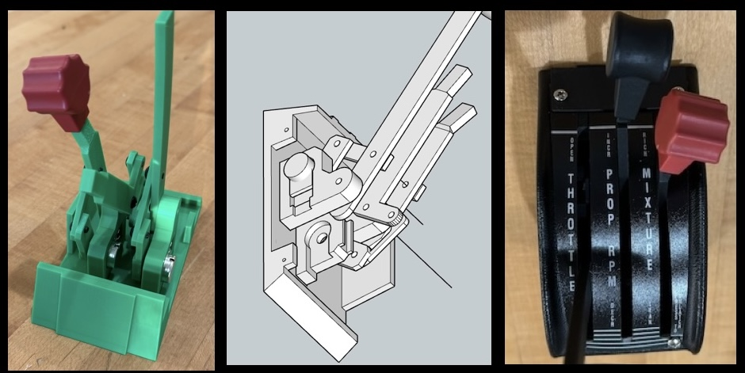
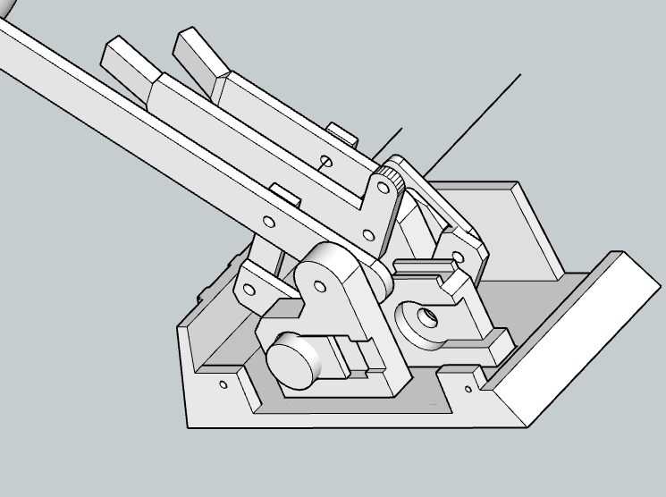
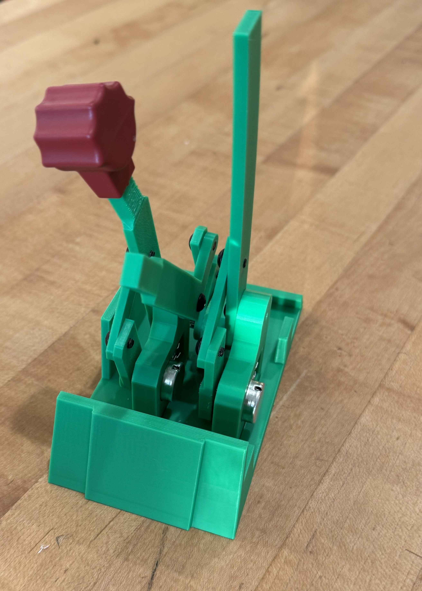
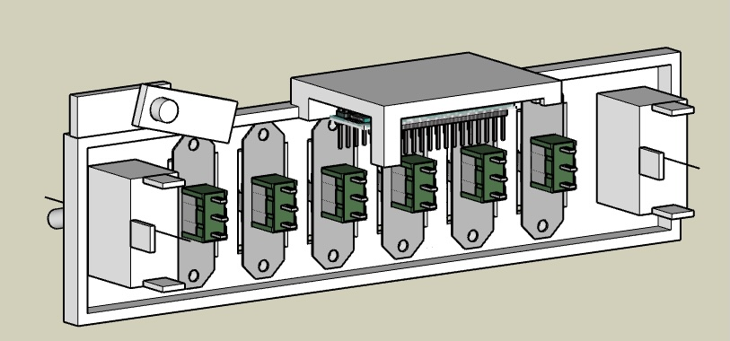
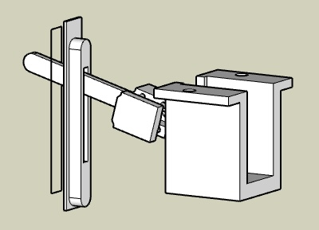
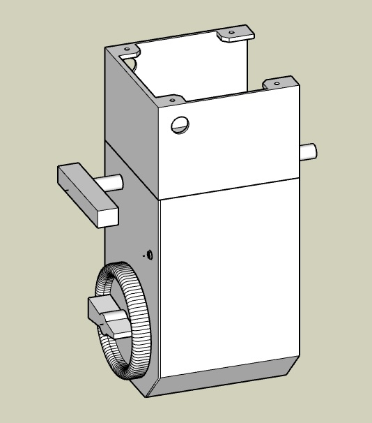
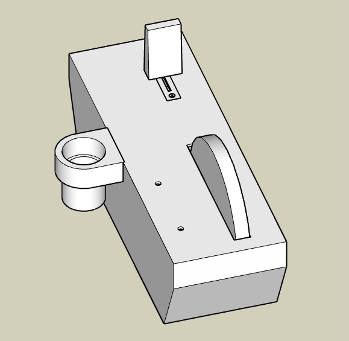
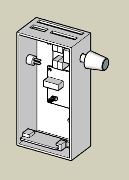

# Piper Dakota Sim

February 2025

The sim was built to practice IFR flying using new avionics that match our real plane. It has also been a great opportunity to learn Arduino and explore my Onefinity CNC/Laser.

ChatGPT tells me that Piper has sold about 30,000 PA-28 series aircraft, compared to 45,000 Cessna 172/182 models. It’s surprising—and somewhat frustrating—for Piper pilots that most commercial flight sim products are Cessna-based. This project was built to create a sim that closely matches our plane.

The sim community is a gem. After learning from so many projects and discussions, I felt guilty for never sharing my work. This document includes the key components, build details, and lessons learned that I believe will be most helpful to others.

The current build would cost about $10,000. Below is a breakdown of prices.

## Hardware Fabrication

### PA28 Throttle

I started by buying a real replacement throttle assembly trim and label, then designed and 3D printed the body.

To fit the closely spaced throttle, prop, and mixture levers, I used bellcranks to offset the potentiometers.

The M4 screws into 3mm PLA holes were not strong enough on their own and required glue for reinforcement. Threaded inserts would be a better solution, as the tight space makes soldering and adjustments difficult.

Label strips are glued to the top of the trim cover under a printed trim plate.

### Bezels

Simple bezels are printed for the yoke, manifold, and tach gauge, carb heat, and TOGA switch openings. I may build a bezel for the JPI Engine monitor.

### Switch Panel

The hardest part of the switch panel was sourcing rocker switches that match a real PA28. I ordered a few alternatives but never found half-width rockers that could be ganged together to match the real set, nor found suitable grey covers.

An Arduino Micro in the switch panel handles:
- Switches
- Throttle
- Carb Heat lever
- TOGA button

### Carb Heat

The Carb Heat lever is printed to sandwich the end of a metal toggle. The assembly also has a switch holder under the table. A printed panel trim insert keeps the lever sliding vertically with a realistic feel.

MSFS offers Anti Ice On or Off, but no variable carb heat setting like a real PA28.

### Center Column

A bolted support box under the table houses:
- Parking Brake  
- Fuel Selector Switch  
- Rudder Trim  
- Arduino Pro (which also controls the key switch)  

Due to printer bed limitations, the column is built from two stacked boxes. The parking brake is mounted to the ceiling of the lower box.

### Parking Brake 

I ordered the SimWales Parking Brake (designed for a Cessna 172) from caspajack on eBay, and it works well.

However, Parking Brake On and Off controls do not function correctly in either the Cessna 172 or RV-10.  
Workaround: Mapped the Off control to Parking Brake Toggle for reliable operation.

### Fuel Selector 

The Fuel Selector switch is simply a trim piece over a 5-selector switch.

A real Piper PA-28-235 has these five fuel positions:
1. Off
2. Left Tip
3. Left Main
4. Right Main
5. Right Tip

I couldn’t find a published plastic trim piece design or an MSFS Dakota with a four-tank configuration.

### Rudder Trim

A potentiometer identical to the throttle levers is used for rudder trim. Mounted with a custom-printed bracket for the center column.

### Key Switch

I ordered the SimWales Key Switch from caspajack on eBay. The spring mechanism is well-designed, and the build quality is excellent.

Installation Tip: The table height required lowering the switch slightly. The key position was aligned first, then the pin, so it properly hits the spring on Start.

### Trim and Flaps

For realism, the Elevator Trim box is mounted on the right side of the chair, replacing the keyboard tray mount.

Inside the box:
- Trim Wheel  
- 4-position Flaps Paddle  
- Arduino Micro (glued with the USB port facing down)  

The Trim Wheel, potentiometer, and switch were salvaged from a Desktop Aviator unit I purchased on eBay.

### Compass & Dimmer

The whiskey-style Compass was purchased from SimWales (via caspajack on eBay) and looks fantastic.

MobiFlight controls the compass, with custom settings:
- Display Scale: 9000  
- Transform: `$ * (-12.5)`

Powered via USB 5V cable.

## Arduinos

Before this project, I had no prior experience with Arduino or circuit board assembly.

Initial mistakes:
- Soldered IDC ribbon cables directly to Arduino pins → Difficult for maintenance.
- Each control had a separate connector → Increased wiring complexity.

Later improvements:
- Used connectors soldered on the Arduino.
- Switched to more durable wiring solutions.

Detailed pinout available in arduino-pins.csv.

## Full Components List & Pricing

🔗 [Click here for the full parts list](parts.md)

## Images & SketchUp Models

- 3D models are available in SketchUp.  
- Files include faceplate designs for CNC/laser cutting.
