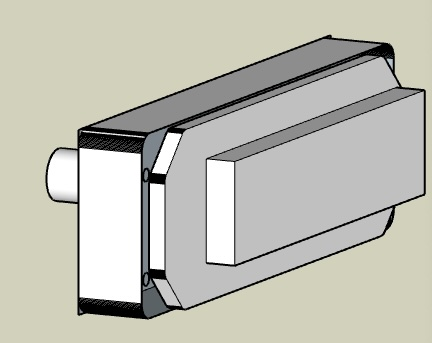

# Piper Dakota Sim

*February 2025*

The sim was built to practice IFR flying using avionics that match our real plane. It has also been a great opportunity to learn Arduino and explore my Onefinity CNC/Laser.

ChatGPT estimates that Piper has sold about **30,000 PA-28 series aircraft**, compared to **45,000 Cessna 172/182 models**. Since most commercial flight sim products are Cessna-based, I built this project to closely match our **Piper Dakota**.

After learning from so many projects and discussions in the **flight sim community**, I felt it was time to share my work. This document includes the key components, build details, and lessons learned that I believe will be most helpful to others.

**Total estimated cost:** ~$10,000

---

## 🔧 Hardware Fabrication

### PA28 Throttle

I started with a real **replacement throttle assembly trim and label**, then designed and **3D-printed the body**.

To fit the **closely spaced throttle, prop, and mixture levers**, I used **bellcranks to offset the potentiometers**.

**Issues & Fixes:**
- M4 screws into 3mm PLA holes weren’t strong enough. **Threaded inserts** would be a better solution.
- Label strips are **glued** under a printed trim plate.

### Bezels

Custom **3D-printed bezels** for:
- **Yoke, manifold, tach gauge**
- **Carb heat, TOGA switch**
- Planning a **JPI engine monitor bezel**

### Switch Panel

The hardest part was sourcing **rocker switches** that match a real PA28. I never found half-width rockers that could be ganged together properly.

**Future Upgrade:**
- **Laser-engraved labels** on switch covers.

### Arduino Integration

An **Arduino Micro** handles:
- **Switches**
- **Throttle**
- **Carb Heat lever**
- **TOGA button**

### Carb Heat Lever

- The **lever is 3D-printed** and attaches to a **metal toggle switch**.
- A **printed trim insert** keeps the movement vertical and smooth.
- **MSFS only supports On/Off** (no variable carb heat like real PA28s).

### Center Column

A **bolted support box under the table** houses:
- **Parking Brake**
- **Fuel Selector Switch**
- **Rudder Trim**
- **Arduino Pro (also controls key switch)**

Since my **3D printer bed is only 255mm**, the column is **stacked boxes**. **Next time**, I’d use a **side-mounted brake** and leave an **open column** for easier maintenance.

### Parking Brake

The **SimWales Parking Brake** (for a Cessna 172) was **bought on eBay** and works well.

**MSFS Quirk:**
- **“Parking Brake On/Off” doesn’t work for the 172 or RV-10**
- **Workaround:** Map **Off control** to **“Parking Brake Toggle”**

### Fuel Selector

Piper PA-28-235s have a **center firewall-mounted fuel selector** with:
- **Off**
- **Left Tip**
- **Left Main**
- **Right Main**
- **Right Tip**

I couldn’t find **any MSFS Dakota mod with a four-tank configuration**.

### Key Switch

The **SimWales Key Switch** was bought on **eBay (caspajack)**.
- **Spring mechanism** is well-designed.
- **Table height forced me to mount it lower** than real life.

### Trim and Flaps

- **Elevator Trim box** is mounted on the **right side of the chair**.
- **Trim Wheel, 4-position Flaps Paddle** (Arduino Micro inside).
- Trim **wheel and switch salvaged** from **Desktop Aviator unit**.

### Compass & Dimmer

The **SimWales whiskey compass** was **controlled via MobiFlight** with **custom settings**.

A **printed enclosure houses**:
- **Arduino Pro Micro**
- **Compass stepper motor driver**
- **Dimmer for compass & glare lighting**
- **12V power with hydra connector**

### Headset

- **USB aviation adapter** was stripped and panel-mounted.
- Required **insulating bushings** due to ACM panel grounding issues.

---

## 🖥️ Software & Avionics

### Air Manager

- **Purchased 2 years ago**, still **reliable and used daily**.
- Best **G5 instrument** ($25) – better than Asobo’s version.
- Uses a **community-built JPI** instrument.

### TDS GTNxi Pro

- **Essential for G3X integration** (Main reason I switched from X-Plane).
- **TDS Support** has been **excellent**.
- **Issue:** Needs **manual nav source switch (750 to 650) every MSFS launch**.

### MSFS Popup Panel Manager

- **Developed by Stanley Kwok** (free tool for popouts).
- **MSFS lacks proper touch support**.

### MobiFlight

- Controls my **GNC255 radio & compass**.
- Considering migrating **custom Arduino instruments** to MobiFlight.

---

## 🖥️ RealSimGear Integration

### Instruments in Use:
- **G5** – Fully mapped, works great.
- **G500** – Originally for X-Plane, adapted for G3X.
- **GTN650** – **Home button is fake**.
- **GFC500 Autopilot** – **Trim knob is flimsy**.
- **GMA350 Audio Panel** – No longer sold by RealSimGear.

---

## 💰 Components & Pricing

[Full Pricing List Available Here](pricing.md)

---

## 📷 Images & SketchUp Models

- All **3D models are available in SketchUp**.
- Files include **faceplate designs for CNC/laser cutting**.

---

## 📜 Conclusion

This build has been a **huge learning experience**, from **hardware fabrication** to **Arduino programming**. I hope this documentation helps others in the **flight sim community**.

---

## ✅ Next Steps

- Upload **images** into an `/images/` folder.
- Copy this `index.md` into your **GitHub repository**.
- Add `_config.yml` to enable **Minima theme styling**.

---
